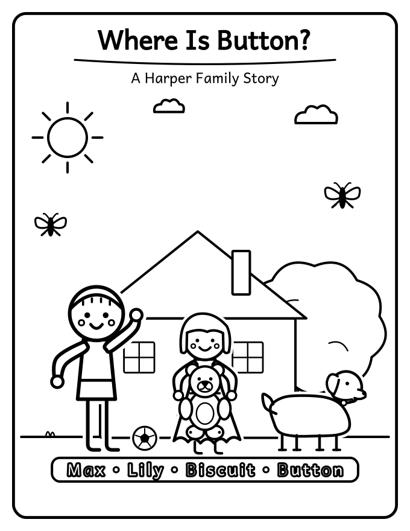
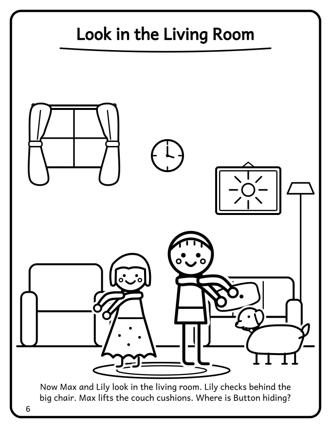
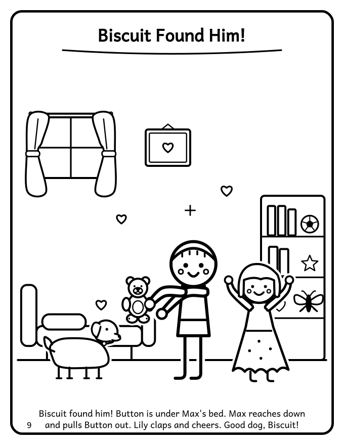

# coloring-book — a Claude Code skill for personalized kids' coloring books

Give it your kids' names, hair, glasses, freckles, pets, and favorite things — get back a
printable, letter-size vector PDF coloring book starring them. Themed pages ("their
favorite things") or **story mode** for ages 3-6 (a gentle 10-beat quest with captions
built for pre-readers: simple present tense, name repetition, a chant-along refrain).

<p align="center">
  
</p>

*The bundled example, "Where Is Button?" — a fictional family's teddy-bear hunt,
built end-to-end by the skill.*

## Why it works (design choices)

- **Parametric characters, not AI likeness.** Each child is a small trait vector
  (hair silhouette, glasses, freckles, height, a personal motif). Same recognizable
  kid on every page, zero identity drift, no photos needed or wanted.
- **Everything is bold vector line art** (SVG → PDF), tuned to age-band line weights.
  No diffusion raster output, no broken gray lines.
- **A shape cookbook instead of freehand geometry.** LLMs reliably botch bicycles and
  side-view cars; the skill ships ~20 object helpers plus relative-proportion recipes
  (derived from public-domain 1910s drawing pedagogy and MIT-licensed icon skeletons —
  see [CREDITS.md](CREDITS.md)).
- **Anti-tangency matting** (`matted()`) knocks white halos out of backgrounds around
  figures, so rug lines can't visually fuse with dress hems.
- **Tile-based QA loop**: pages are re-rendered as overlapping zoom tiles and reviewed
  (by subagents when available) for collisions, floaters, and ambiguous shapes.
- **Deterministic validation gate**: `python -m lib.validate pages/*.svg` turns every
  numeric layout rule into exact arithmetic on the emitted SVG (border clearance,
  connected-mass span, head clearance, mat-swallowing, ground tangency, text fit...)
  and fails on HIGH findings — guarded by a pytest suite.
- **Smooth organic figures + line vocabulary**: a Catmull-Rom→Bézier engine
  (`smooth_path`, `limb`) rebuilds kid arms and animal silhouettes as tapered
  G1-continuous outlines; `scallop_edge`, `hatch_region`, `echo` and friends replace
  hand-drawn decoration.
- **Colorable letters & words**: Andika (SIL OFL) glyph outlines baked to paths —
  hollow colorable letters, dashed trace-style name pages with ruled guidelines,
  banners auto-sized from glyph metrics. No font install needed at render time.
- **Interest packs + scene kits**: 230+ helpers indexed by interest in
  `reference/catalog.md` — vehicles, trains, planes, boats, space, flowers,
  wild/farm animals, games, buildings — plus `lib/scenes.py` composite
  backgrounds (meadow, street, beach, space, farm) with declared ground lines,
  and landscape systems (mountains, roads, fences, skylines).
- **Creativity layer**: blank speech bubbles, finish-the-symmetry and
  finish-the-picture pages (dashed hints via per-element clip paths), pattern
  menus to copy, design-your-own templates, sticker sheets — pages that invite
  the child's own art, with validator-aware `layout="creative"` marking.
- **People for every story**: run/jump/point/carry/sleep poses, hand-holding
  pairs, toddler proportions, a wheelchair user, and cap/scarf/cape accessories.
- **Photo mode**: `lib/photolib.py` turns photos into splinter-free colorable
  outlines — flow-coherent line extraction, contour averaging, angle snapping,
  subject-aware soft policies (faces protected, architecture squared up),
  closed QA loop; feet-anchored fragments composite traced subjects into scene
  kits beside charlib characters. Fully local (OpenCV + bundled Apache-2.0
  YuNet face model).
- **Model-tier aware**: the skill tells weaker models to run in a conservative
  helpers-only mode and when to escalate — calibrated by benchmarking the same build
  across three model tiers.

## Install

```bash
git clone <this-repo> ~/.claude/skills/coloring-book
```

Then in Claude Code: `/coloring-book` — or just ask for "a coloring book for my kids".

Rendering needs `cairosvg` (`pip install cairosvg`) and Ghostscript (`gs`) for the
final PDF merge.

## Try the example

```bash
cd examples/where-is-button
python3 make_book.py          # full book -> Harper-Coloring-Book.pdf
python3 make_book.py 05       # rebuild just page 5
```

## Layout

- `SKILL.md` — the skill workflow (cast setup → plan → render → QA → deliver)
- `lib/charlib.py` — the drawing library: primitives, motifs, parametric faces/figures,
  animals, furniture, vehicles, page/PDF assembly, QA tile renderer
- `reference/drawing-guide.md` — collision gotchas and age-band rules, learned in production
- `reference/story-mode.md` — the 10-beat arc + caption rules for ages 3-6
- `reference/shape-cookbook.md` — relative-proportion recipes for everyday objects
- `reference/model-tiers.md` — operating modes and escalation ladder by model capability

## License

- **Code** (`lib/`, `examples/`): [AGPL-3.0-or-later](LICENSE). Chosen deliberately:
  this is a for-fun community project, and AGPL means anyone who builds a service on it
  must share their improvements back. Personal and family use is completely unencumbered.
- **Documentation and recipes** (`SKILL.md`, `reference/`): CC BY-SA 4.0.
- Upstream reference material and its licensing: [CREDITS.md](CREDITS.md).

Photos of real children never belong in this pipeline — the skill extracts trait
*buckets* ("short hair, glasses") at most, and works fine with none.

## Using this outside Claude Code (other agents / LLMs)

The skill is plain markdown + Python, so any agent can use it — but three things are
non-negotiable, and skipping them is why hand-rolled attempts come out rough:

1. **Execute `lib/charlib.py`** (Python + `cairosvg` + Ghostscript). Do not re-implement
   the helpers "in the spirit of" the library — the geometry is battle-tested and the
   helpers do ordered white-fill layering internally.
2. **White fills, back-to-front.** Every solid shape is drawn with `fill="white"` over
   what's behind it, in depth order, and figures get `matted()` halos. Outline-only
   drawing produces transparent shapes whose strokes all cross each other.
3. **Verify numerically** (see `reference/drawing-guide.md`): scene bbox ≥55% of page
   height, nothing within 12px of the border, figures ≥180px. Every model bottom-crams
   first drafts; arithmetic catches it when eyeballing doesn't.

If your environment can't run Python, the honest move is to say so rather than
approximate — the output difference is not subtle.
